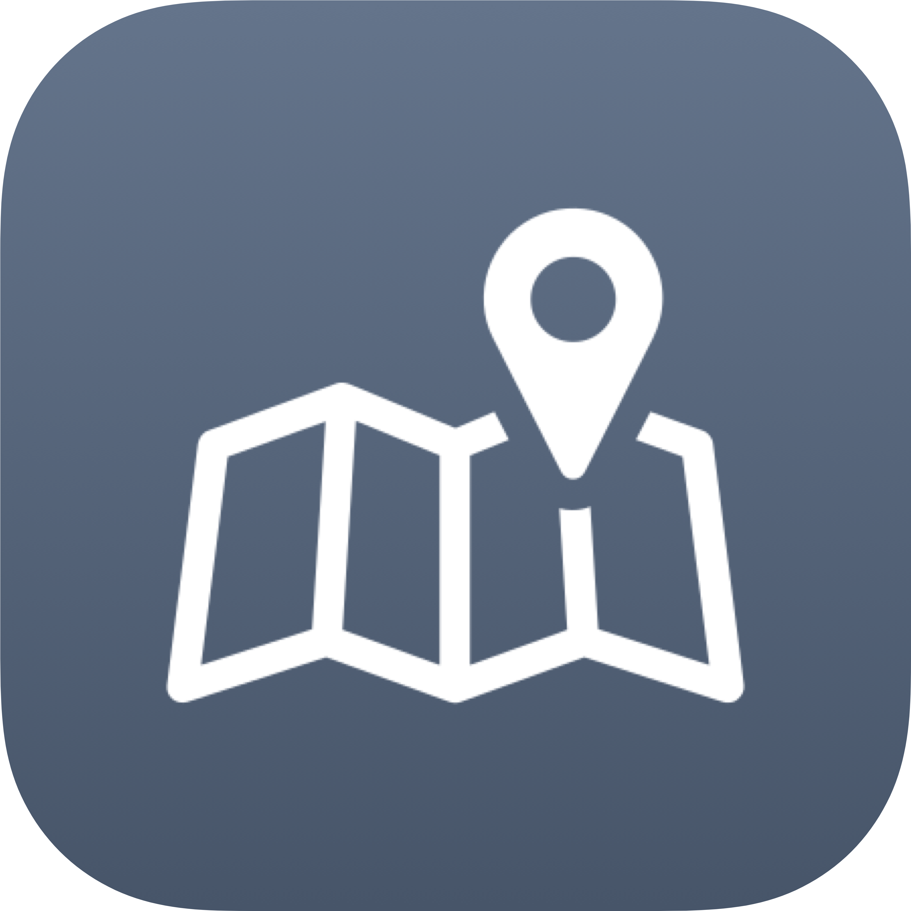

<p align="center">
<a href="https://github.com/JawadYzbk/atlas-for-rust"></a>
    <br>
<a href="https://github.com/liamcottle/atlas-for-rust">Big thanks for Liam cottle for all his efforts developing the Base App</a>
    
</p>

<h2 align="center">Atlas for Rust (Rust+ Unofficial alternative for PC )</h2>

## What is Atlas

Atlas is an **unofficial** interactive map experience for [Rust](https://rust.facepunch.com/). It uses the same websocket protocol that the official [Rust+ Companion app](https://rust.facepunch.com/companion) uses to communicate with the Rust game servers.


## Features

- Shows a realtime updating interactive map, including:
    - Hackable Crates
    - Cargo Ship
    - Chinook
    - Explosions
    - Vending Machines
    - Patrol Helicopters
    - Traveling Vendors
    - Team Members
- **Enhanced Grid System**
    - Dynamic grid overlay with 150m squares for accurate positioning
    - Grid labels with coordinate system (A1, B2, etc.) for easy location reference
    - Smart zoom-based visibility - grid appears at zoom level 2 and above
    - Adaptive label sizing that scales with zoom level for optimal readability
    - Customizable grid line thickness and color (black lines for better visibility)
    - Dynamic spacing and margins that adjust based on zoom level
- **Advanced Vending Machine Search & Shop Interface**
    - Enhanced search functionality with real-time filtering
    - Buy/Sell order type toggle for comprehensive market analysis
    - Advanced sorting options (by name, stock, and price)
    - Zero stock filter toggle to hide out-of-stock items
    - Modern UI with gradient headers and improved styling
    - Empty state indicators for better user experience
    - Redesigned shop contents with modern card-based layout
    - Improved item display with stock indicators and hover effects
- **Traveling Vendor Support**
    - Added support for traveling vendor markers on the map
    - Standardized map marker icon sizes for consistency
- Shows realtime server stats
    - Current player count
    - How long since last wipe
- Display real-time in-game time with day/night indicator
- Send and Receive realtime Team Chat messages
- Search items for sale in Vending Machines across the map
- Supports "Pairing" with Rust Servers from the in game menu
- Supports adding Rust servers manually without using the in game pairing menu
    - Useful if you run your own server and have access to server files

## Recent Improvements

### Grid System Enhancements
- **Accurate Grid Positioning**: Grid now properly aligns with Rust's 150m coordinate system
- **Improved Visibility**: Grid lines changed to black color with optimized thickness (0.5px) for better contrast
- **Smart Label Management**: Grid labels (A1, B2, etc.) are hidden at minimum zoom and scale dynamically with zoom level
- **Enhanced Spacing**: Dynamic margins and padding that provide optimal spacing at different zoom levels
- **Performance Optimized**: Grid rendering optimized for smooth interaction across all zoom levels

### Vending Machine & Shop Enhancements
- **Advanced Search & Filtering**: Implemented comprehensive search with buy/sell toggle, sorting by name/stock/price, and zero stock filtering
- **Modern UI Design**: Redesigned vending machine search and contents with gradient headers, card-based layouts, and improved visual hierarchy
- **Enhanced User Experience**: Added empty state indicators, hover effects, and smooth transitions for better interaction
- **Market Analysis Tools**: Buy/sell order type selection for comprehensive market overview and price comparison

### User Experience Improvements
- **Zoom-Responsive Design**: All grid elements adapt intelligently to the current zoom level
- **Better Readability**: Font sizes and spacing automatically adjust for optimal visibility
- **Cleaner Interface**: Grid elements remain unobtrusive while providing essential positioning information
- **Smooth Interactions**: Enhanced transitions and hover effects throughout the interface
- **Intuitive Controls**: Improved form controls and toggle switches for better usability

## Features to Implement

- Map
    - Add custom markers with colour and name to the map
- Smart Devices
    - Pair with Smart Devices
    - View list of Smart Devices per server
    - User could place custom markers on map showing where Smart Alarms are triggered
- Atlas Auto Updater, currently users will need to update manually from GitHub releases

## How to Install

- Download the latest installer from [Releases](https://github.com/JawadYzbk/atlas-for-rust/releases)
- After downloading, run `AtlasForRust-x.y.z-win.exe`
- Connect with Rust+ from the Atlas welcome screen
- Pair with your Rust server from the in game menu

## How to build for development

Download and Install Dependencies

```
git clone https://github.com/JawadYzbk/atlas-for-rust.gith
cd atlas-for-rust
npm install
```

Run Electron app for Development

```
npm run electron:serve
```

## Build for Mac, Windows and Linux

At this stage, GitHub actions only builds and releases Windows versions of Atlas. However, if you want to run Atlas on Mac or Linux, you can use the command below.

```
npm run electron:build -- --mac --win --linux
```

## Updating Rust Assets

Atlas uses images and metadata from the Rust game files. These can be updated with the [update_assets.js](./update_assets.js) script.

```shell
node update_assets.js "<drive>:\SteamLibrary\steamapps\common\Rust"
```

## Contributing

If you have a feature request, or find a bug with Atlas, please open an issue here on GitHub.
